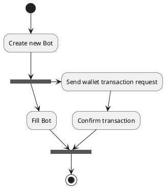
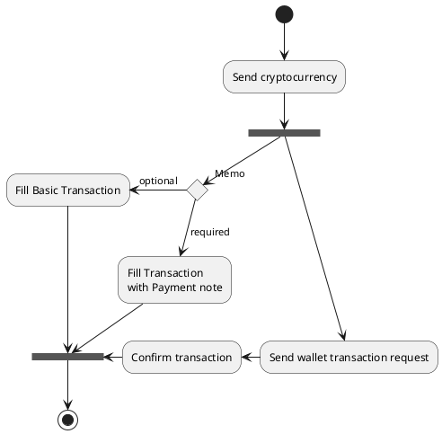
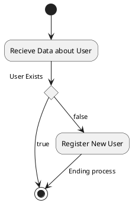

## Activity Diagrams
#### CreateBot

```plantuml
@startuml
(*) --> "Create new Bot"
--> ===B1===
--> "Fill Bot"
--> ===B2===

===B1=== -right-> "Send wallet transaction request"
-down-> "Confirm transaction"
--> ===B2===

--> (*)
@enduml
```

#### Withdraw

```plantuml
@startuml
(*) --> "Send cryptocurrency"
--> ===B1===
-up-> if "Memo" then 
-->[required] "Fill Transaction 
with Payment note"
--> ===B2===
else
-left->[optional] "Fill Basic Transaction"
--> ===B2===

===B1=== -down-> "Send wallet transaction request"
-left-> "Confirm transaction"
-left-> ===B2===

--> (*)

@enduml
```

#### Registration 

```plantuml
@startuml

(*) --> "Recieve Data about User"

if "User Exists" then
  -->[true] (*)
else
  -->[false] "Register New User"
  -->[Ending process] (*)
endif

@enduml
```
